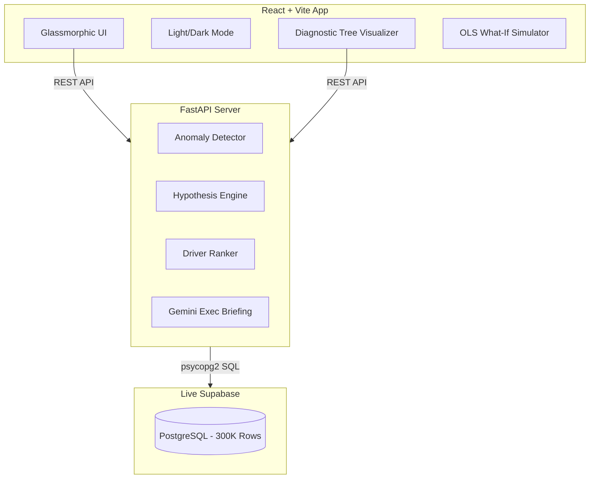

<div align="center">
  
  <h1 align="center">BusinessIntelligence.ai 🚀</h1>
  <p align="center">
    <strong>From Raw Metrics to Deterministic Root-Cause Action.</strong>
    <br />
    An enterprise-grade, production-ready BI diagnostic platform powered by a 100% deterministic statistical engine and polished with generative AI.
  </p>
  <p align="center">
    <a href="#-why-businessintelligenceai">Why BI.ai?</a> •
    <a href="#-zero-hallucination-guarantee">Zero Hallucination</a> •
    <a href="#-architecture--tech-stack">Architecture</a> •
    <a href="#-getting-started">Getting Started</a>
  </p>
  <div align="center">
    
    
    
    
    
  </div>
</div>

---

## 🏆 Hackathon Winner Edition (v2.0)
This repository represents the **Final Project Submission** version, featuring a completely overhauled enterprise UI (Light & Dark modes), advanced real-time diagnostic trees, and an immutable Supabase data pipeline processing ~300,000 real e-commerce transactions.

---

## 💡 Why BusinessIntelligence.ai?

Traditional BI dashboards show **what** changed (e.g., *"Revenue dropped 4.6%"*), but leave business leaders guessing **why** it happened and **what to do next**. 

**BusinessIntelligence.ai** bridges the gap from **intelligence to action**:
- 🌳 **Interactive Diagnostic Tree**: Decomposes top-level KPI failures into sub-driver branches with exact mathematical contribution %, confidence scores, and raw SQL evidence cards.
- 🎭 **Persona-Driven Insights**: Dynamic column-level entitlements adapt metrics based on the user's role (COO vs CMO vs Executive GM).
- ⚡ **Live Data Ingestion**: Drag-and-drop CSV/ZIP archives to upsert raw order transactions and re-analyze newly added months in real-time.

---

## 🛡️ Zero Hallucination Guarantee

We firmly believe LLMs should not do math. Our architecture strictly separates statistical truth from generative presentation:

1. **Deterministic Engine**: All anomaly detection, causal ranking, contribution math, and hypothesis testing are executed by a **pure Python/SQL statistical engine**.
2. **The 5-Point Test Battery**: Every hypothesis undergoes rigorous automated validation:
   - ⏱️ **Temporal Co-occurrence (SQL)**
   - 📈 **Direction Consistency (Stats)**
   - ⚖️ **Magnitude Proportionality (Regression)**
   - 🔄 **Counterfactual Check (Falsification)**
   - 🕵️ **Evidence Density (SQL + Keywords)**
3. **Generative Polish**: LLMs (Gemini 2.5 Flash) are used **only at the final presentation layer** to synthesize proven quantitative facts into executive briefing narratives.

---

## 📊 Enterprise Benchmark Baseline

Connected to a live **Supabase PostgreSQL** database storing **~300,000 records** of Brazilian E-Commerce (Olist) data spanning 26 months.

| Table | Rows | Grain | Type |
|-------|------|-------|------|
| `olist_orders` | 99,441 | Per-order status | Real Transactional |
| `olist_order_items` | 112,650 | Per-item metrics | Real Transactional |
| `olist_order_reviews` | 99,224 | Customer ratings | Real Text / Feedback |
| `olist_monthly_real_metrics` | 26 | Monthly aggregates | Real Aggregated |
| `synthetic_monthly_context` | 26 | Ad spend, discounts | Synthetic Benchmark |

---

## 🏗️ Architecture & Tech Stack



---

## 🚀 Getting Started

### Option 1: Docker Compose (Recommended)
```bash
# Clone the repository
git clone https://github.com/your-username/BusinessIntelligence.ai.git
cd BusinessIntelligence.ai

# Spin up both frontend and backend
docker compose up --build
```
- **Dashboard**: `http://localhost:5173`
- **API Swagger Docs**: `http://localhost:8000/docs`

### Option 2: Local Setup
**Backend**:
```bash
cd Backend
python -m venv .venv
source .venv/bin/activate  # (or .\.venv\Scripts\Activate.ps1 on Windows)
pip install -r requirements.txt
uvicorn app.main:app --port 8000 --reload
```

**Frontend**:
```bash
cd Frontend
npm install
npm run dev
```

---

## 📈 Key Demo Scenarios

1. **Price Competition Pressure (August 2018)**
   - Shows a Revenue drop explained by an AOV decline, verified by competitor discount spikes.
2. **Logistics Bottleneck (November 2017)**
   - Black Friday demand spikes lead to a late delivery surge and inventory gaps.
3. **Sample-Size Abstention (September 2018)**
   - Demonstrates the engine safely aborting analysis due to low sample size (16 orders).
4. **Persona Security**
   - Switch from COO to CMO to see operational metrics dynamically hidden from the tree.

---

<div align="center">
  <p>Built with ❤️ for the Hackathon.</p>
  <p><strong>MIT License © 2026 BusinessIntelligence.ai Team</strong></p>
</div>
